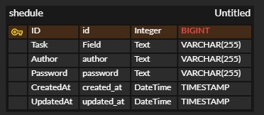

### intro. 
API, ERD, SQL을 만들어서 기초적인 설계를 작업을하여 API 설계와 구현 능력, CRUD 작업의 이해와 구현 능력, SQL 및 데이터베이스 활용 능력을 상승 시켰고, 결과적으로 웹 애플리케이션의 기본 구조를 설계하고 구현하는 전반적인 기술을 습득하였다.

### 1. 일정 생성 API

- **URL**: '/api/schedules'
- **Method**: 'POST'
    - **Request Body**:
      - **task**: 할 일 내용
      - **author**: 작성자 이름
      - **password**: 비밀번호(수정/삭제시 필요)
      - **createdAt와 updatedAt 필드는 서버에서 자동으로 현재 날짜와 시간으로 설정됩니다.**

```json
{
  "task": "요리 레시피",
  "author": "백종원",
  "password": "1234"
}
```

- **Response**: 
  - 201 created

```json
{
  "id": 1,
  "task": "후기 작성",
  "author": "갑",
  "createdAt": "2024-01-01T10:00:00",
  "updatedAt": "2024-01-01T10:00:00"
}
```

- 400 Bad Request (잘못된 입력 데이터 시)
```json
{
  "status": 400,
  "error": "Bad Request",
  "message": "입력 데이터가 유효하지 않습니다."
}

```

### 2. 전체 일정 조회 API

- **URL**: '/api/schdules'
- **Method**: 'GET'
- **Query Parameters (선택)**
  - **updatedAt**: 조회할 일정의 수정일
  - **author**: 조회할 일정의 작성자 이름
  - **updatedAt 또는 author 중 하나, 또는 둘 다 포함할 수 있으며, 조건이 없는 경우 전체 일정 목록을 조회합니다.**
  - **정렬 기준**: updatedAt(수정일) 기준으로 내림차순 정렬하여 반환
  
- **Response**:
  - '200 OK'

```json
[
  {
    "id": 1,
    "task": "과제 제출",
    "author": "김씨",
    "createdAt": "2024-01-01T013:00:00",
    "updatedAt": "2024-01-01T14:00:00"
  },

  {
    "id": 2,
    "task": "TIL 작성",
    "author": "박씨",
    "createdAt": "2024-01-01T021:00:00",
    "updatedAt": "2024-01-01T22:00:00"
  }
]
```

### 3. 특정 일정 조회 API

- **URL**: '/api/schedules/{id}'
- **Method**: 'GET'
- **Path Parameters**
    - **id**: '조회할 일정의 고유 ID'
- **Response**: 

  - '200 OK'(성공시)

```json
{
  "id": 1,
  "task": "강의 수강",
  "author": "스파르탄",
  "createdAt": "2024-01-01T09:00:00",
  "updatedAt": "2024-01-01T21:00:00"
}
```

  - 404 Not Found (일정이 존재하지 않을 시):

```json
    {
    "status": 404,
    "error": "Not Found",
    "message": "일정을 찾을 수 없습니다."
    }
```

## 4. 일정 수정 API

- **URL**: /api/schedules/{id}
- **Method**: 'PUT'
- **Request Parameters**
    - **id**: '수정할 일정의 고유 ID'
- **선택한 일정 수정**
  - 선택한 일정 내용 중 '할 일 내용', '작성자 이름'만 수정 가능하며, 이때 서버에 비밀번호를 함께 전달합니다.
  - 작성일 은 변경할 수 없으며, 수정일 은 수정 완료 시, 수정한 시점으로 변경합니다.
- **Request Body**
  - **task**: 수정된 할 일 내용
  - **author**: 수정된 작성자 이름
  - **password**: 비밀번호(수정/삭제시 필요)

```json
{
  "task": "수정된 할 일 내용",
  "author": "수정된 작성자 이름",
  "password": "비밀번호"
}
```

- **Response**:

  - '200 OK'(성공 시):
  
```json
{
      "id": 1,
      "task": "수정된 할 일 내용",
      "author": "수정된 작성자 이름",
      "createdAt": "2024-01-01T10:00:00",
      "updatedAt": "2024-01-02T10:00:00"
}
  ```
  
  - '403 Forbidden' (비밀번호 불일치 시):

```json
{
  "status": 403,
  "error": "Forbidden",
  "message": "비밀번호가 일치하지 않습니다."
}
```

  - '404 Not Found' (일정이 존재하지 않을 시):

```json
{
  "status": 404,
  "error": "Not Found",
  "message": "일정을 찾을 수 없습니다."
}
```

## 5. 일정 삭제 API

- **URL**: /api/schedules/{id}
- **Method**: 'DELETE'
- **Request Parameters**
    - **id**: '수정할 일정의 고유 ID'
- **선택한 일정 삭제**
  - 선택한 일정을 삭제할 수 있으며, 이때 비밀번호를 서버에 함께 전달합니다.
- **Request Body**
  - **password**: 비밀번호(수정/삭제시 필요)
  
```json
{
  "password": "비밀번호"
  }
```

- **Response**
  - '204 No Content'(성공 시): 요청이 성공해도 클라이언트에게 따로 응답을 반환하지 않음.
  - '403 Forbidden'(비밀번호 불일치 시)
  
```json
{
  "status": 403,
  "error": "Forbidden",
  "message": "비밀번호가 일치하지 않습니다."
}
```
  - 404 Not Found (일정이 존재하지 않을 시)
```json
{
  "status": 404,
  "error": "Not Found",
  "message": "일정을 찾을 수 없습니다."
}
```



## 공통 적용 사항
    1. API 실행 및 테스트(포스트맨), Entity를 DTO에 담아서 반환하기.
        - Entity의 데이터를 API에 선택적으로 반환해야 하는 경우, 해당 반환 조건에 맞는 DTO 객체에 담아서 반환.

    2. 일정 작성, 수정, 조회 시 비밀번호가 반환 되지 않게 하기.

    3. 일정 수정 및 삭제 시 선택된 일정의 비밀번호와 수신 받은 비밀번호가 일치할 경우에만 결과가 반환 되게 하기.
        - 비밀번호 불일치 시 적절한 오류 코드 및 메세지를 반환.

    4. 일정 생성, 수정, 삭제 시 적절한 상태 코드를 반환.

    5. 3 Layer Architecture.
        - Controller, Service, Repositery 계층을 분리하여 구현.
            -> 각각 가장 위, 중간, 가장 밑에 위치하며 각 계층은 상호작용을 함.

    6. JDBC 사용
        - ScheduleRepository 클래스의 save, findAll, findById 메서드에서 JDBC 코드를 작성 후, JdbcTemplate을 통해 SQL 쿼리를 사용하여 데이터 베이스에 연동함(JDBC를 직접적으로 사용).
            -> ScheduleService와 ScheduleController 클래스는 데이터 베이스에 연동된 데이터를 사용함(JDBC를 간접적으로 사용).

## Lv 1: 일정 생성 및 조회
    -> 전체 일정과 선택 일정을 조회

    1. ScheduleEntity 클래스
        -> 일정에 대한 정보를 저장

        1-1. Getter와 Setter 메서드
            -> 필드 값을 반환 및 설정

    2. ScheduleDTO 클래스
        -> 데이터 반환 시, 비밀번호는 제외하고 반환함.


    3. ScheduleRepository 클래스
        -> JdbcTemplate을 활용하여 자바에서 CRUD를 구현.

              Create: 일정 생성 -> INSERT 쿼리를 사용하여 데이터베이스에 데이터를 추가.
              Read: 전체 일정 조회 및 선택 일정 조회 -> SELECT 쿼리를 사용. 이때, RowMapper를 이용하여 데이터베이스의 데이터를 각 클래스의 객체로 Mapping한다.
              Update: 선택 일정 수정 -> UPDATE 쿼리를 사용하여 id와 password를 확인 후, 데이터베이스에서 데이터를 수정함.
              Delete: 선택 일정 삭제 -> DELETE 쿼리를 사용하여 id와 password를 확인 후, 데이터베이스에서 데이터를 삭제함.

    4. ScheduleService 클래스
         -> 일정 생성, 조회, 수정, 삭제 처리를 하는 비즈니스 로직을 구현.

    5. ScheduleController 클래스
         -> 클라이언트의 요구 사항을 각 엔드포인트에서 처리하여 응답을 반환한다.

## Lv 2: 비밀번호 확인을 통해 일정 수정 및 삭제 기능을 구현. 이때, 비밀번호가 맞는 경우에만 작업이 수행됨.

      1. ScheduleService에 수정 및 삭제 메서드 추가.

      2. ScheduleController에 수정 및 삭제 엔드포인트 추가.


